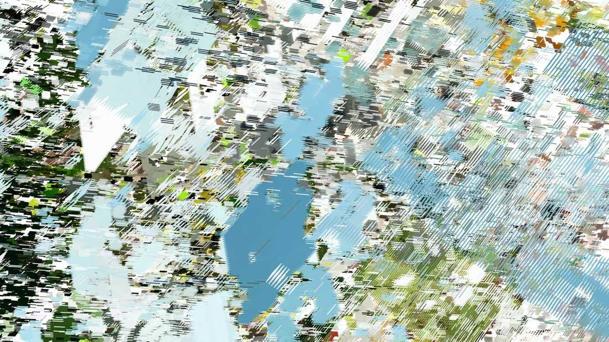
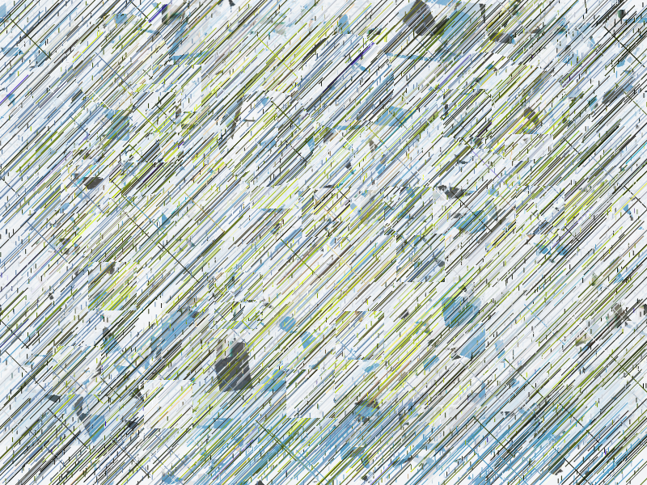

# Final Project

For the final project, I tried recreating [Casey Reas' piece, A Mathematical Theory of Communication](https://landmarks.utexas.edu/artwork/mathematical-theory-communication) using p5.js. To achieve this, I utilized a few p5.js scripts (e.g., `script7.js`, `fragment3.js`) that involved combining, fragmenting, line glitching, and layering images collected from the Pexel API. These images comprised blue skies, forests, clouds, and city lights. I could match most of the colors and spirit of the piece (retrieving and distorting groups of images). Still, in the original work, there is more depth of color, and it includes these really interesting large blue and light-blue fragments that I've yet to figure out.

###Original

###Recreation

